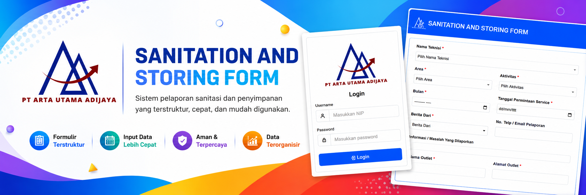
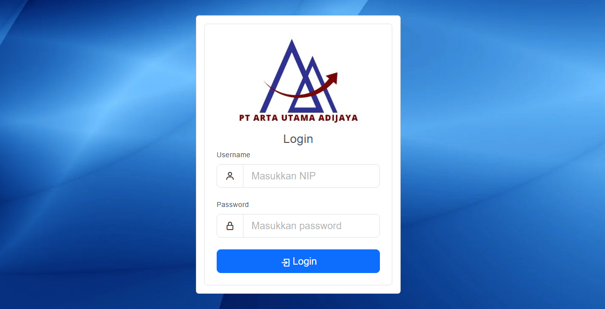

# Maintenance & Service Management System (SHOWCASE)
   

  

Service Management System merupakan aplikasi berbasis web yang dikembangkan untuk mendukung proses pelaporan, pencatatan, dan monitoring berbagai aktivitas layanan operasional perusahaan, termasuk sanitasi, penyimpanan (storing), serta perawatan dan perbaikan chiller.

Sistem ini memungkinkan pengguna untuk membuat permintaan layanan, mengelola data teknisi, mencatat aktivitas pekerjaan, mendokumentasikan permasalahan yang dilaporkan, serta memantau status penyelesaian pekerjaan melalui platform yang terintegrasi.

Dengan digitalisasi proses operasional, aplikasi membantu meningkatkan efisiensi kerja, akurasi data, serta kemudahan dalam pelacakan riwayat layanan dan pelaporan.

---

## Tentang Project

Service Management System membantu proses pengelolaan dan monitoring berbagai aktivitas layanan operasional perusahaan, seperti sanitasi, penyimpanan (storing), serta perawatan dan perbaikan chiller. Sistem ini dirancang untuk mendukung pencatatan service request, penugasan teknisi, dokumentasi pekerjaan, dan pelaporan aktivitas secara terstruktur dalam satu platform terintegrasi.

Selain digunakan untuk mengelola aktivitas layanan operasional, sistem ini juga mendukung monitoring teknisi yang tersebar di berbagai kota di Indonesia melalui pengelolaan data teknisi, pemantauan progres pekerjaan, pencatatan riwayat layanan, dan dashboard monitoring terpusat. Dengan digitalisasi proses operasional, perusahaan dapat meningkatkan efisiensi kerja, akurasi data, transparansi pelaporan, serta kemudahan dalam melakukan evaluasi dan pengambilan keputusan berdasarkan data yang tersimpan secara terpusat.

---

## Fitur Utama

* Manajemen data teknisi
* Manajemen area kerja
* Pelaporan Sanitasi & Storing
* Service dan Maintenance Chiller
* Monitoring aktivitas teknisi
* Dokumentasi masalah dan tindakan perbaikan
* Pendataan outlet dan lokasi
* Laporan dan riwayat pekerjaan
* dll

---

## Teknologi yang Digunakan

* PHP
* Laravel Framework
* MySQL
* Bootstrap
* JavaScript

---

## Screenshot

### Login Page

  

---
